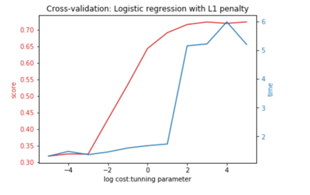
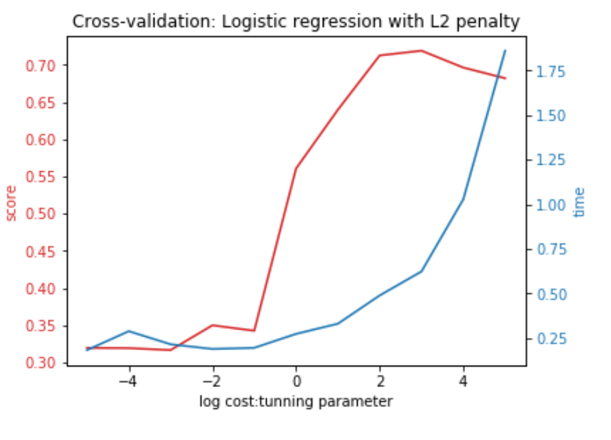
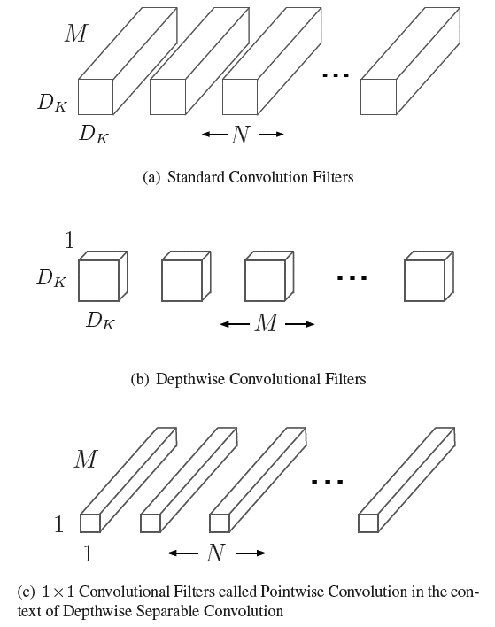
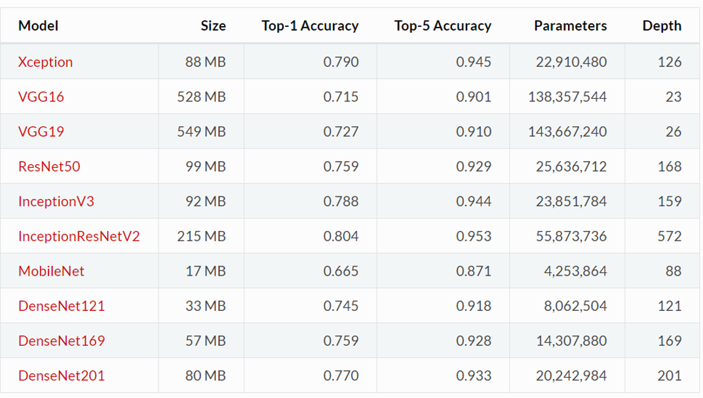

# Project: Dogs, Fried Chicken or Blueberry Muffins?


### [Full Project Description](doc/project3_desc.md)

Term: Spring 2018

+ Team #4
+ Team members
	+ Lin, Yanjun
	+ Jiang, Chenfei
	+ Tao, Wenyi
	+ Wan, Qianhui
	+ Yao, Jingtian

In this project, we created a classification engine for 3000 images of dogs versus fried chicken versus blueberry muffins using various model evaluation and selection methods. The primary concerns and evaluation criterion are around computational efficiency and memory cost. We found that MobileNet has a very high validation accuracy and it is relatively computational efficient when comparing to other CNN structures. This model outperforms all other non-deep-learning models in accuracy, and it is not computational costly, which means it could be applied to the mobile device very efficiently.  

This project can be divided into 2 part:
#### Part 1 Feature extraction
For feature extraction, our team compared various methods including :
+ ORB 
+ SIFT (basic)
+ SURF (fast version of sift)
+ RGB (with color)


Feature extraction requires a lot of time for preprocessing. In ORB, SIFT, SURF we use bags of words idea and choose 2000 as number of cluster. After K-means clustering, we have 2000 features to describe each picture. The performance depends on the feature dimensions and extraction time. 

#### Part 2 Classification machine
On top of the base model using SIFT feature extraction and Gradient Boosting method, we applied a series number of advanced models including :
+ LinearSVM 
+ SVM with RBF kernel
+ XGBoost
+ Logisitcal Classifier

All the parameter for each model are fine-tuned with 5-fold cross-validation techniques. Take the basic logistical regression as an example:




We compare each model with different parameters and evaluate the time efficiency. For each model we choose the parameter with the best performance.


#### Part 3 Deep-learning: state of art image analysis

+ Advanced Model: We applied fine tuning on MobileNet, pretrained on ImageNet, as our advanced model. And after cross-validation, we change the final dense layer from dense(1024) to dense(256), which has 256 units in the layer.



The model comparison within deep-learning model:




**Contribution statement**: Jingtian Yao extracted RGB feature from images, trained Xgboost model and selected parameters by 5-folds cross-validation. Qianhui Wan applied SVM linear and Kernal models and improved the model by selecting tuning paramters and Cross-validation. Yanjun Lin tried serval CNNs, and compared their results and running time，and applied data augmentation, fine tunning on ImageNet pretrained models and cross validation on the size of last layer.


Following [suggestions](http://nicercode.github.io/blog/2013-04-05-projects/) by [RICH FITZJOHN](http://nicercode.github.io/about/#Team) (@richfitz). This folder is organized as follows.


```
proj/
├── lib/
├── data/
├── doc/
├── figs/
└── output/
```
Please see each subfolder for a README file.
